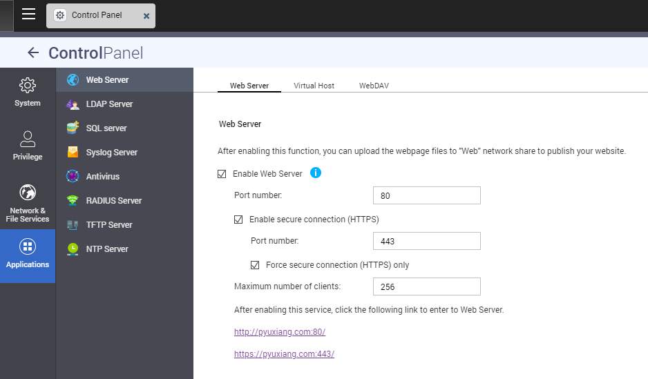

===============================================================================
QNAP
===============================================================================

We focus a little more on QNAP's deployment of the Apache server, since this
is the context with which I deployed my own website.

Web GUI
=======

QNAP does provide a web administration page, which abstracts away some of the
complexity behind Apache configuration. But you'll need to manually work
with the configuration files in order to get customized performance.

For the record, I'm using QNAP TS-431P. Apache is already pre-loaded and can
be easily enabled under the ``Web Server`` tab in the Control Panel.
There are several options in the Web GUI, including:

- Enable Web Server (not sure what this triggers)
- Enable secure connection (HTTPS): ``apache-ssl.conf``
- Force secure connection (HTTPS) only: ``apache-force-ssl.conf``
- Enable Virtual Host: Adds ``httpd-vhosts-user.conf`` and
  ``httpd-ssl-vhosts-user.conf`` to the global config
- Create Virtual Host: Adds entries to each virtual host file (w/o auth)

QNAP cloud link
---------------

If the server does not have a public IP address / DNS record, the services on
the QNAP NAS can still be accessed via the QNAP servers using the hostname
``USERNAME.myqnapcloud.com`` instead. Here, my server can be accessed using
the hostname ``pyuxiang.com`` which was bought from and managed under GoDaddy.

Software version
================

The Apache executable is located at ``/usr/local/apache/bin/apache``.
The service should have already started by default. To determine the
version number:

.. sourcecode:: none

    [~] # /usr/local/apache/bin/apache -v
    Server version: Apache/2.4.37 (Unix)
    Server built:   May 31 2019 04:09:39

Apache2.4 is the latest version of Apache, at the time of writing.

Directories
===========

The actual Apache subdirectories are located in ``/mnt/ext/opt/apache``
which contains the Apache binaries and
modules, as well as ``/mnt/HDA_ROOT/.config/apache`` containing
the configuration files.
Symbolic links are commonly used to reference these two subdirectories, i.e.
``/usr/local/apache`` and ``/etc/config/apache`` respectively.

.. sourcecode:: none

    [~] # ls /mnt/ext/opt/apache
    bin/     cgi-bin/ conf@    lib/     links/   logs/    modules/ share/

    [~] # ls /mnt/HDA_ROOT/.config/apache
    apache.conf      extra/           mime.types       php-fpm.conf
    apache.conf.bak  magic            original/

The ``apache.conf`` is the global Apache configuration file. This file is named
differently in other distributions, including ``httpd.conf`` and
``apache2.conf``. This file is responsible for admin-level settings for the
HTTP server. This `article <https://www.digitalocean.com/community/tutorials/
how-to-configure-the-apache-web-server-on-an-ubuntu-or-debian-vps>`_
explains some global configurations in the ``apache.conf`` file.

The ``.config/apache/extra/`` directory contains the rest of the settings,
including the two important files required for the virtual host:

- ``httpd-vhosts-user.conf`` governs the access controls via HTTP
- ``httpd-ssl-vhosts-user.conf`` governs the access controls via HTTPS

Restarting Apache webserver
---------------------------

After every modification to the Apache configuration files (with the
exception of the runtime ``.htaccess`` files), the Qthttpd service needs to be
restarted, which can be done using the command
``/etc/init.d/Qthttpd.sh restart``.

The syntax for the configuration files can be checked using
``/usr/local/apache/bin/apachectl -t``.

Root directory
--------------

According to `this forum post <https://forum.qnap.com/
viewtopic.php?t=100689>`_, the root directory should be kept at
``/share/Web`` due to dependencies in other Apache configuration files
(although I'm not too sure which one). Since the path itself is a symlink,
it's trivial to change the symlink to point to the specific subdirectory that
you want.

Note that this is relevant only if virtual hosts are not used.

Authentication
==============

The ``htpasswd`` utility is found in ``/usr/local/apache/bin/htpasswd``.

SSL certificate
---------------

The private key and certificate signing request (public key) is a key-pair
that can be generated using OpenSSL. This CSR is then used to
request for a certificate from the CA provider, which is then added to the
server.

For QNAP, the certificate uploading can be performed using the Web GUI,
but the files can also be manually referenced from within the directory tags.

.. sourcecode:: none

    <VirtualHost *:443>
        ServerName pyuxiang.com
        DocumentRoot "/share/Web"
        <Directory "/share/Web">
            Options FollowSymLinks MultiViews
            AllowOverride All
            Require all granted
        </Directory>
        SSLEngine on
        SSLCipherSuite EECDH+CHACHA20:EECDH+AES128:RSA+AES128:EECDH+AES256:RSA+AES256:!MD5
        SSLProtocol All -SSLv2 -SSLv3
        SSLCertificateChainFile "/etc/stunnel/uca.pem"
        SSLCertificateFile "/etc/stunnel/stunnel.pem"
    </VirtualHost>

Virtual Hosts
=============

Multiple host names can be redirected to webpages located in different
directories using virtual hosts. The DNS must first contain the appropriate
CNAME records to point each subdomain prefix to the IP address from which the
server can be accessed, before the server can begin to resolve the hostnames.

.. sourcecode:: none

    # DNS Records (for the domain 'pyuxiang.com')

    +-------+-------+---------------+
    | Type  | Name  | Value         |
    +-------+-------+---------------+
    | A     | @     | 223.25.79.103 |
    | CNAME | www   | @             |
    | CNAME | notes | @             |
    +-------+-------+---------------+

A quick check to make sure the subdomain can be resolved:

.. sourcecode:: none

    PS C:\> nslookup notes.pyuxiang.com
    Server:  router.asus.com
    Address:  192.168.1.1

    Non-authoritative answer:
    Name:    pyuxiang.com
    Address:  223.25.79.103
    Aliases:  notes.pyuxiang.com

Virtual hosts enable multiple hostnames to be served different webpages
using the same Apache server, distinguished by the hostname. This is enabled
using ``Enable Virtual Host`` flag from within the QNAP Web GUI.
Note that this method does not automatically configure authentication services,
so we dive into the configuration files instead.

In QNAP, the virtual hosts via HTTPS is found in
``/etc/config/apache/extra/httpd-ssl-vhosts-user.conf``, while those via HTTP
found in ``/etc/config/apache/extra/httpd-vhosts-user.conf``.
Note that in this example, I used ports 80 and 443 for HTTP and HTTPS
respectively:

.. sourcecode:: none

    NameVirtualHost *:80

    <VirtualHost _default_:80>
        DocumentRoot "/share/Web"
    </VirtualHost>
    <VirtualHost *:80>
        ServerName notes.pyuxiang.com
        DocumentRoot "/share/Web/notes/build"
        <Directory "/share/Web/notes/build">
            Options FollowSymLinks MultiViews
            AllowOverride All
            Require all granted
        </Directory>
    </VirtualHost>

Small reminder that ``Listen 80`` and ``Listen 443`` need to be in the
configuration file as well, for the Apache server to listen to those ports.
Only a single listen command is allowed though, and they might already exist
in these locations:

- ``Listen 80`` at around line 17 in ``apache.conf``
- ``Listen 443`` at around line 3 in ``apache-ssl.conf``

HTTPS forcing
-------------

The Apache server uses pattern matching to redirect HTTP requests to HTTPS
instead, using ``mod_rewrite``. This is automatically enabled when the
"Force secure connection (HTTPS) only" flag is set in the QNAP Web GUI.

.. sourcecode:: none

    Define _qweb_port 80
    Define _qweb_ssl_port 443
    Define _myqnapcloud_hostname pyuxiang.myqnapcloud.com
    Define _qweb_ext_port 8112
    <VirtualHost _default_:${_qweb_port}>
        RewriteEngine On
        RewriteCond %{HTTP_HOST} ^([^:]+)(:[0-9]+)?$
        RewriteRule ^ https://%1:${_qweb_ssl_port}%{REQUEST_URI} [R,L,NE]
        <IfDefine _myqnapcloud_hostname>
            RewriteCond %{HTTP_HOST} ${_myqnapcloud_hostname} [NC]
            RewriteRule ^ https://${_myqnapcloud_hostname}:${_qweb_ext_port}%{REQUEST_URI} [R,L,NE]
        </IfDefine>
    </VirtualHost>

Enabling Apache modules
=======================

The QNAP Apache server comes preloaded with some common Apache modules found
in ``/usr/local/apache/modules``.
To figure out how to enable MOD_WSGI now...

Issues
======

2020-12-21
----------

Have been trying to figure out how to deal with webpages being cached by the
browser, causing my webpages to not be updated at all.

Fiddling with ``mod_expires`` by adding the line
``ExpiresDefault "access plus 2 minutes"`` into the Apache configuration file
caused the whole QNAP to bug out. And I didn't save any backups...
Spent the next two hours trying to get the settings back.
