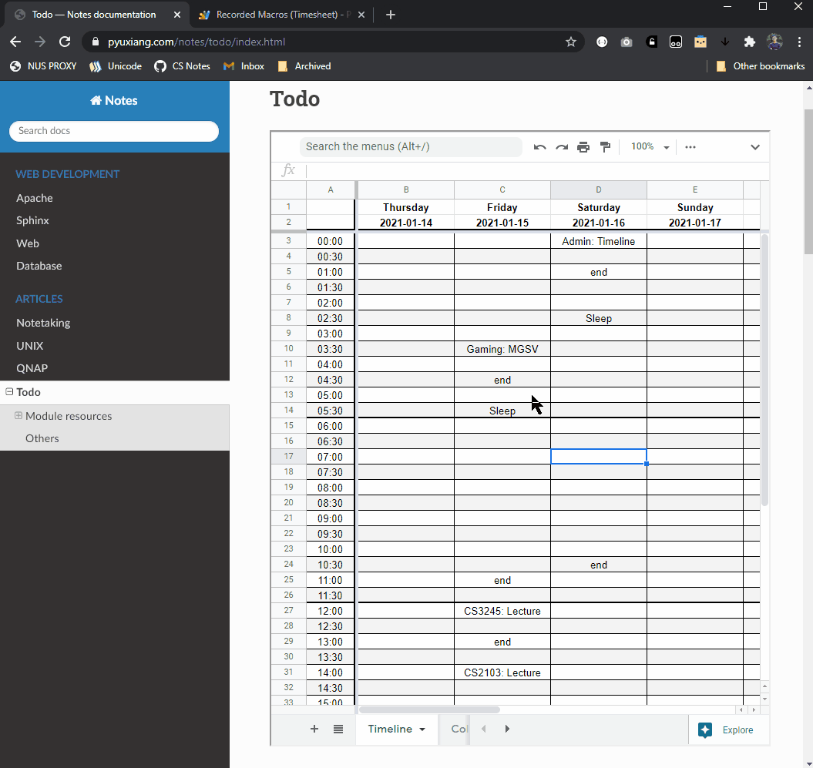
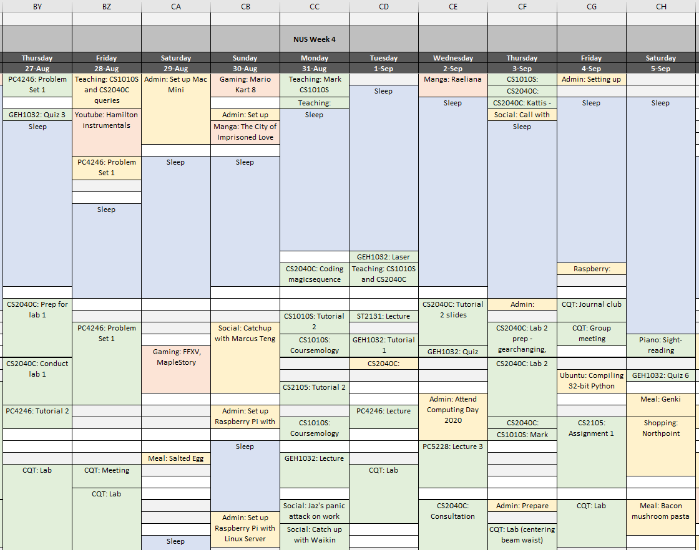

===============================================================================
Projects
===============================================================================

Starting documentation of mini-projects, to justify disappearing time.

2021-01-16 Google Sheets Timeline
=================================

Wrote mini script to automatically format time blocks on a Google Sheets
time tracker.

I actually already have one on Excel, with many more macros written in
VBA script.

Issue is when working on multiple computers, changes tend to go
out-of-sync since they depend on the sync queue of Dropbox. A method to update
this on a phone would be even better, hence offloading to Sheets.

Most of the time comes from identifying time blocks + merging and assigning
colours based on the productivity of the session. Figured I automate this as
well.
